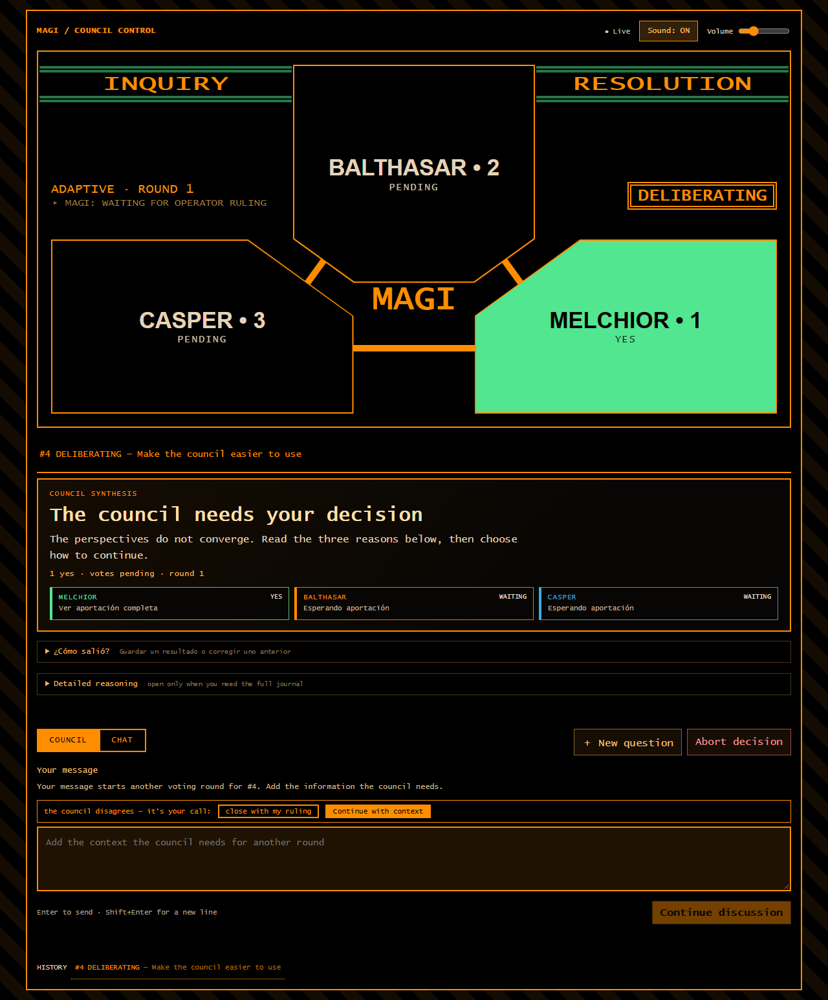
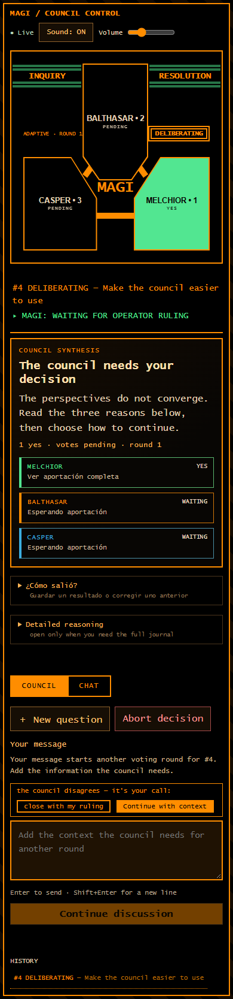

# MAGI Council — three AI heads that deliberate, vote and execute

[](https://github.com/Adrian-Sandwich/magi-council/actions/workflows/ci.yml)

A **MAGI council of three heads** (Melchior / Balthasar / Casper — the persona
lives in the seat, the provider is swappable: kimi, codex, claude, Ollama, any
CLI or OpenAI-compatible API) that deliberate on your questions and vote on
decisions, with a ruling, minority report, mind changes between rounds and
human arbitration. With **memory**: a local knowledge graph that ingests your
agent sessions and decisions and injects them into every deliberation. And in
**production mode**: the council approves a plan, an executor implements it on
a dedicated branch, the council reviews the diff and — on unanimous approval —
it merges itself.

The UI is a MAGI-style web app (design based on TomaszRewak/MAGI) with a
single text box, like a CLI. Runs on Windows, macOS and Linux.





## What you need to get started (from scratch, on any machine)

1. **Python 3.14+**.
2. **A reachable Postgres** (any standard install; the system default is
   `dbname=debate host=localhost`, port 5432, user = your OS user). If you
   have none, on Windows the repo ships a portable postmaster in
   `experiments/pg` and `bin\start-magi.bat` starts it.
3. **At least one head** (with no heads the system runs "degraded" and only
   you can close decisions):
   - **kimi** (or another MCP-capable agent CLI: claude, …) — investigates
     the repo with tools and votes via MCP;
   - **codex** or another plain-text CLI — votes with the journal inlined in
     the prompt (`journal: "inline"` mode);
   - **Ollama / LM Studio / any OpenAI-compatible endpoint** — local API
     head at no cost.
   All configured in `debate-mcp/heads.json`; you don't need all three.
4. Optional: an **OpenAI** account (codex) and/or **Moonshot** (kimi) if you
   use those cloud heads.

## Install and first run

```bash
git clone https://github.com/Adrian-Sandwich/magi-council.git
cd magi-council/debate-mcp

# venv (Windows: .venv\Scripts\python -m venv .venv)
python3.14 -m venv .venv && .venv/bin/pip install -r requirements.txt

# database (idempotent; creates the schema or applies what's missing)
.venv/bin/python schema/migrate.py

# all good? (needs Postgres up)
.venv/bin/python smoke_test.py
```

Per-OS shortcuts:

- **Windows**: double-click `Iniciar MAGI.bat` in the repository root. It
  starts portable Postgres (if needed), migrates, starts relay + UI in the
  background, and opens your browser. Logs are in `debate-mcp/logs/`.
  `debate-mcp\bin\start-magi.bat` also uses this launcher.
  `debate-mcp\bin\stop-magi.bat` shuts everything down.
- **macOS/Linux**: `.venv/bin/python relay.py` and `.venv/bin/python magi_ui.py`
  (daemonize them as you like; `launchd/install.sh` is the macOS way).

Then open **http://127.0.0.1:8051**.

**Registering the MCP in your agents** (so CLI heads can see the board): the
repo ships `.mcp.json` at the root — any agent running from the repo loads it
automatically (on Windows it points to `.venv/Scripts/python.exe`; on
macOS/Linux change it to `bin/python`). The same file also ships the
`codebase-memory` server: local structural code intelligence — search, trace,
architecture and dead-code queries over this repo. The first session indexes
the repo once, then it keeps itself fresh; no API key and no data leaves the
machine. Its command points to a local install path, so adjust it if cbm
lives elsewhere on your machine. For a global config, your agent
usually has a command like `kimi mcp add` / `claude mcp add` pointing at
`debate-mcp/server.py` with the venv's python.

**Memory graph** (optional but recommended): run `memory-graph/refresh.sh`
once (ingests your agents' sessions, decisions and READMEs into
`memory-graph/memory.db`) and schedule it (Windows:
`schtasks /create /tn "ClaMi-memory-refresh" /tr "...bash... refresh.sh" /sc hourly`
— the task name is yours to pick; macOS/Linux: cron or launchd). Without the
graph the system works, but the heads remember nothing. The 3D export
(`export_kgraph.py`) is optional: without a `Node_visualizer` checkout it
prints a notice and the refresh still succeeds. Each ingestor records its
last run in `memory.db`, and `healthcheck.py` reports the age of every
source separately — the relay's 30-second conversation sync keeps the file
fresh, so the file's mtime alone says nothing about sessions, docs or code.

The relay also syncs conversations and decisions into the graph continuously
(the heartbeat and `healthcheck.py` show the last sync). Retrieval is
keyword-based by default; **semantic retrieval** (local multilingual
embeddings — no text leaves the machine) is optional: install it once with
`debate-mcp/.venv/bin/pip install -r debate-mcp/requirements-semantic.txt`
and `debate-mcp/.venv/bin/python debate-mcp/semantic_memory.py --download`
(model goes to `memory-graph/models/`). `MEMORY_SEMANTIC=0` disables it;
without the model the system falls back to keyword search. Explicit
declarations you write in chat (`Objetivo: …`, `Restricción [datos]: …`,
`Pendiente [pruebas]: …`) are kept per conversation as sourced, versioned
facts.

System status at any time: `.venv/bin/python healthcheck.py` (Postgres, relay,
stuck decisions, graph freshness per source, and seats whose failure rate over
the last week exceeds 30 % in their current role). On Windows schedule it
every 15 minutes with a toast on failure:
`powershell -ExecutionPolicy Bypass -File debate-mcp\bin\schedule-healthcheck.ps1`
(`-Remove` unregisters; log in `debate-mcp/logs/healthcheck.log`). Latency, error
and timeout rates per seat and turn type (from `logs/trigger_events.jsonl`):
`.venv/bin/python metrics.py --days 30` — including approximate tokens per
turn (prompt, output and memory block, at 4 characters per token; what a
head reads on its own with tools is not visible). A CLI head that dies
within seconds of starting with no output is retried once before its turn
is marked ERROR.

What a head receives per turn: the journal (last 15 messages, 18 000
characters at most), the memory block (at most 5 dossiers and 4 500
characters, only sources that share the thread, the title, enough topic
terms or semantic similarity — a dossier from the same repository with no
topic in common is not memory, it is padding), and in round 1 of a decision
with a repository a **repository brief** built from the code graph (size,
folders, HTTP entry points, most-referenced and most recently changed
files) so heads with tools read what matters instead of exploring. Retrieval quality against your own
board's real follow-ups: `memory-graph/eval_retrieval.py` (leave-one-out;
see `docs/memory-evolution.md`).

## How you use it (the web, in 30 seconds)

A single text box with two modes (tabs at the top left):

### COUNCIL — decisions with a vote

Your message goes to the council. If there's no open decision, it **opens a
new one**: the three heads investigate (CLI heads can read the repo; all of
them see the journal and the **memory graph**) and vote in parallel:

- **APPROVED / REJECTED**: 2/3 majority or unanimous.
- **CONDITIONAL**: approved with conditions (kept in the dossier).
- **STALEMATE**: no agreement. The council writes you a **query**: choose
  **Continue with context** for another round or **Close with my ruling** to
  close it with your decision. Type the context or ruling and press send.

Unanimous `info` votes go straight to the evaluation of one shared answer
(until 2026-09-18 a contrast round was forced first, costing ~2.5 minutes
and ~12k tokens per question even when the three answers already agreed;
`INFO_MIN_ROUNDS` in `decision.py` restores it). Editorial fidelity and acceptance of its content are separate.
Substantive objections feed another debate round, up to three rounds per human
continuation. At the limit, or if a reviewer fails, the answer is explicitly
provisional; matching `INFO` votes alone never establish content consensus.

If you selected an open or STALEMATE decision, your message goes **to it**:
context while it's deliberating; on a STALEMATE you explicitly choose to
continue or close. Continue is the initial option and the buttons keep your
text.

The UI sends the selected decision's ID. A follow-up to a closed decision
reopens the same dossier on its existing thread, preserving the journal and
memory context; **New question** is the explicit way to start a separate
decision. If a selected decision disappeared before your message arrived,
you get an error instead of having it land on another decision. On a
decision in execution, text adds context and **"retry"** enables the retry
after a failure. The failure history is preserved. **New question** prepares
another query without sending it. The send button shows **Ask council**,
**Implement approved plan**, **Add context** or the selected action. The repo field
is only offered when opening a decision. During a disconnect sending pauses;
errors keep your draft and never auto-retry.

Each head's polygon carries the vote word (`YES`, `NO`, `CONDITIONAL`,
`INFO`, `PENDING`, `ERROR`) as well as the colour, so colour is never the
only channel. On phones the triangle turns square so its labels stay legible
and the live activity line moves to the status bar; touch targets are at
least 44 px on coarse pointers.

**Sound: OFF / ON** enables original 100% synthesized industrial cues:
contactors once the server accepts your message (the result, not the click),
a pneumatic press when a head votes, a motor starting for execution, a
three-impact verdict, a short two-pulse plant alert when the council is stuck
waiting for you, and a distinct falling-tone failure cue when execution or
merge fails, a head errors out, or a send is rejected. It starts off, offers volume and
remembers your preference locally. It plays no Evangelion recordings or
music: everything is synthesized on the fly with WebAudio.
First load and reconnections don't replay old notifications.
The triangles keep the MAGI aesthetic, are keyboard-accessible and open the
reasoning in a dialog that closes with Escape. The UI adapts to mobile and
respects the system reduced-motion preference.

The optional browser tests live in `tests/test_ux_browser.py`: they need
Playwright and `CLAMI_BROWSER_PATH` pointing at Chrome or Chromium. They
intercept every request and never send messages to the real board.

### CHAT — open conversation with the three heads

Your message opens a round in a shared thread and the heads answer in turn,
each from its axis (Melchior: technical truth · Balthasar: risk and care ·
Casper: what you actually want). Think "asking three colleagues at once",
not a vote. Chat also closes with two crossed verdicts or when you arbitrate.

**Which one when?** COUNCIL when you want a **decision with backing** (should
I do X?, do we merge?, which approach?) — it's audited with confidence and
minority report. CHAT when you want to **explore ideas, opinions or
discussion** without formality.

### The `#n` (the row of colored chips)

Each decision has a number: `#12`. The chips at the bottom are your
**history** — click one and you're back in that deliberation with its
conversation. The color is the verdict: green APPROVED, red REJECTED, orange
CONDITIONAL, blue INFO, gray STALEMATE. `#4 CONDITIONAL` means "decision 4
closed with conditions".

### Synthesis and outcomes

For the most recently active closed, split or executing decision, the relay
prepares a **joint synthesis**: one head drafts the answer and every expected
head reviews it for fidelity to the sources (up to two correction cycles).
The UI shows the answer, shared points, differences and open questions; a
draft that didn't clear every review is marked **partial** with the
outstanding objections. The editor writes under fixed style rules — the
council's voice in the third person (never "my axis"), plain language, at
most 120 words and five sentences, at most three items per list, no
commentary on the journal or the process, at most five consolidated
conditions each a single verifiable sentence, and no conditions at all for
a question without a repository — and a draft that breaks them is rewritten
once before the fidelity review. `python council_synthesis.py --retry <id>`
regenerates the synthesis of a decision by hand. The vote percentage is labeled as vote agreement,
not factual certainty.

The synthesis card also lists which memory-graph sources the council saw in
the round, with **👍 Sirvió / 👎 No sirvió**: your rating is stored with a
snapshot of those sources, feeds the graph, and gives `eval_retrieval.py` a
hand-labeled set. It never changes votes or reopens anything.

**¿Cómo salió?** lets you record how a decision turned out — worked, failed,
partial or unconfirmed — with an observation, an evidence reference and an
optional learning. Reports stay on the decision (it never reopens, never
re-arms executions), sync to the memory graph, and new context flags when
earlier reports disagreed.

The memory roadmap and its known limits live in `docs/memory-evolution.md`.

### Switching repo or working folder

The **Repository** field under the box: paste a path (`C:\src\my-repo`)
or browse and click **use this folder**. Selecting a folder prepares a new
question, even when viewing a closed decision. The intent line shows its
target before sending; CLI heads investigate with cwd there. Repository
selection alone requests analysis. Without a repo, decisions use the
system's repo (this one) or the relay's default (`DEBATE_DEFAULT_CWD`).

### Execution evolves from the conversation

There is no production mode switch. A request starts as one conversation. If
it already asks to implement something, MAGI treats the approved result as an
executable plan. If it began as analysis, continue the closed dossier with a
natural instruction such as **"vamos con tu plan"**, **"arréglalo"** or
**"aplica la propuesta"**; **"apruebo tu plan"** is understood as the same
execution intent. The intent line announces the transition before
sending. Execution is only allowed for an approved decision; its selected
repository or the configured default repository becomes the isolated worktree:

1. The council **deliberates the plan** (like any decision).
2. If approved, the **executor** (the seat with `"executor": true` in
   heads.json, Balthasar/Codex by default) implements it on branch
   `magi/d<n>` in its **own worktree**, from the saved base commit. Your
   directory and your uncommitted files stay out of that execution.
3. A **review** opens on the exact produced commit. The heads inspect the
   worktree; the dossier stores the review ID, base SHA and reviewed SHA. If
   the executor leaves uncommitted changes, execution fails before review.
   Review votes are scoped to the approved plan: unrelated findings and work
   explicitly deferred to another decision may be recorded, but do not block
   this merge.
4. Unanimous → a **`--no-ff` merge is prepared in an integration worktree**
   and your branch advances with `--ff-only`. It requires the same base
   branch, the same base commit, clean directories and the reviewed commit
   intact. The merge content must match what was approved. MAGI supplies a
   local commit identity for the integration commit; it does not require or
   modify your global Git identity. 2/3 majority,
   rejection or later changes → **MERGE PENDING**, with the reason in the
   journal.

When a review closes `conditional`, approving that review does not execute the
review as a new plan and does not reopen it for another debate round. Its
in-scope conditions return to the original production decision, the executor
continues in the same worktree, and MAGI opens a new review for the new exact
commit. The previous reviews and votes remain in the journal.

After production is already merged, an informational follow-up such as
**"qué sigue y qué se hizo"** opens a linked follow-up decision. It cannot
reopen or re-execute the completed production dossier; the new decision keeps
the repository context and records which completed decision it follows.

Once a merged objective has a reviewed synthesis, MAGI may surface one bounded
**next move** supported by the dossier. The proposal states its reason, expected
result, scope, risk and recommendation. **Vamos con esto** opens a linked
production decision that must earn fresh council approval before execution;
**Discutámoslo** opens a linked analysis. **Guardar para después** and
**Terminar** only record the operator's choice. A completed objective never
authorizes the next one by itself, and a proposal can be resolved only once.

Until you ask to implement it, a decision is only **decided**. The conditions from `conditional`
votes in the approved round are preserved for the executor, including the
majority's. If execution fails, it
waits for an explicit retry; failures are never deleted from the journal.

Worktrees are kept in `<git-common-dir>/magi-worktrees/` for inspection and
recovery. After an executor failure, **"retry"** reuses the execution worktree
and opens a new review; after a merge failure, it retries only the already
approved merge and does not run the executor again. It never silently changes
the plan's base. If your base branch moved, open a new plan on that base or
resolve the integration manually. A Postgres lock per
repository coordinates executors and merges across relays sharing that
database. Avoid manual Git operations concurrently during the final
integration step: that lock only coordinates relays.

The live line below `ADAPTIVE · ROUND` is always present in the original MAGI
display: it reports standby, deliberation, synthesis, execution, review,
completion or a next move awaiting authorization. It has a reserved foreground
layer so Casper and Balthasar cannot cover it. While heads, synthesis reviewers
or the executor are running, the active seat polygons pulse in their own
colors. Runtime events carry stable per-seat tokens, so parallel
heads remain distinguishable. Inline journal prompts are bounded by both
message count and character count; a long late-round transcript cannot grow
without limit or overwhelm a CLI process.

Stale reviews — without a commit and review ID bound to the plan — don't
enable auto-merge. They're kept for manual resolution. No schema migration
needed: the new data lives in the existing JSON dossier.

## Configuring the heads (`debate-mcp/heads.json`)

```jsonc
{
  "seats": [
    { "seat": "melchior", "name": "kimi", "type": "cli",
      "bin": "~/.kimi-code/bin/kimi.exe", "args": ["-p"],
      "executor": true },               // <- executes approved plans
    { "seat": "balthasar", "name": "codex", "type": "cli",
      "journal": "inline",              // <- no MCP: vote parsed from stdout
      "bin": "C:/.../debate-mcp/bin/codex.cmd", "args": ["exec"] },
    { "seat": "casper", "name": "qwen2.5-coder", "type": "api",
      "model": "qwen2.5-coder:1.5b",
      "base_url": "http://127.0.0.1:11434/v1", "timeout_secs": 600 }
  ]
}
```

- **type `cli`** (default): a tool-using process. If the agent loads the
  repo's MCP (like kimi/claude), it votes with `cast_position`. `"journal":
  "inline"` is for CLIs that don't load MCP (codex exec): the relay inlines
  the journal into the prompt and parses the `POSITION:` tag from stdout. Pin
  the model in `args` when your provider supports explicit model selection —
  e.g. codex: `"args": ["exec", "-m", "gpt-5.6-luna"]` for the fast/affordable
  tier. Which models your account supports depends on the provider
  (`codex debug models` lists the catalog; the checked-in seats deliberately
  use plain `"args": ["exec"]` so the account default applies).
  without a flag it uses your CLI's default.
- **type `api`**: POST to an OpenAI-compatible endpoint (Ollama, LM Studio,
  llama.cpp). The journal is inlined; same vote contract.

The configured Kimi seat also uses `journal: "inline"` and `tools: true`:
it investigates the selected repository, while the relay supplies the journal
and records its explicit vote. This works outside MAGI's own directory without
requiring a project-local MCP configuration. `prompt_transport: "file"` passes
Kimi a UTF-8 task file through `-p`, avoiding Windows command-length limits;
the default transport for other inline CLIs remains stdin.

Casper uses Claude Code with `--model opus --effort medium`, replacing one
of the two GPT seats. Install Claude Code and run `claude auth login --claudeai`
with your Claude subscription before enabling this configuration. Its current
Windows executable path matches the WinGet installation; adjust `bin` for
other installations. `prompt_transport: "stdin-only"` feeds `claude -p` the
journal without a positional `-`. The seat uses plan permissions for analysis
and the relay records the vote, so no project-local MCP setup is required.

A decision head that times out, exits unsuccessfully, or finishes without a
valid vote is marked **ERROR**, with its reason visible in the UI and journal.
It stays paused across relay restarts. **Reintentar cabezas fallidas** resumes
pending heads after the cause is corrected, preserving votes already received.
CLI output is retained in the bounded per-head logs under `debate-mcp/logs/`.
Missing `POSITION` tags no longer turn into implicit `info` votes.

The personas (axes and biases) live in `debate-mcp/personas.py` — the
provider is just wiring. Switching models is editing heads.json, nothing
more. `MAGI_PERSONA_MODE` selects how much of the persona reaches the prompt:
`off` (no axis, a control), `rhetorical` (axis, guiding question and bias) or
`behavioral` (the same plus one verifiable obligation per seat before voting:
Melchior must verify and cite a fact, Balthasar must list who is harmed and
what is irreversible with a mitigation each, Casper must say what the operator
actually wants and the cheapest path). The obligations are domain-agnostic —
a quoted passage or a source counts as much as `file:line` — because the
council is used for documents and open questions as much as for code; without
a selected repository the heads are told not to search their working
directory at all. `persona_ab.py` re-votes past decisions with one model in
all three seats under each mode and reports vote agreement, unanimity, how
often the axis is merely recited, and argument diversity (1 − vocabulary
Jaccard between heads). On 2026-09-17, with Claude in all three seats over 8
past decisions (4 with a repository, 4 open questions): argument diversity
83 % (off) / 87 % (rhetorical) / 88 % (behavioral); pairwise vote agreement
75 / 67 / 79 %. With n=8 the vote differences are noise; the consistent
effect is on what the heads look at, not on how they vote — the dissent seen
on the live board comes from the different providers. `behavioral` is the
default because it keeps the diversity and makes each head's work
verifiable; `--resume` continues a run cut short by a provider session
limit.

## Architecture at a glance

```
                 ┌─────────────────────────────── http://127.0.0.1:8051
   you ──────────┤  magi_ui.py (stdlib+SSE)  ────┐
                 └───────────────────────────────┤
        ┌───────────────────────────────────────┴───────────┐
        │              Postgres "debate"                    │
        │   decisions · positions · messages (journal)      │
        └───────────────────────────────────────┬───────────┘
                                     LISTEN/NOTIFY│ decision_all / debate_all
        ┌───────────────────────────────────────┴───────────┐
        │  relay.py — turn orchestrator (daemon)            │
        │  fires the 3 heads in parallel · executor         │
        │  (production mode) · auto-merge · memory          │
        └───────────────────────────────────────┬───────────┘
        ┌───────────┬───────────┬───────────────┴───┐
     kimi (CLI)  codex (CLI)  qwen (API/Ollama)   executor
     MCP tools   journal inline  POSITION: tag    (kimi, magi/d<n> branch)
        └───────────┴───────────┴───────────────────┘
        ┌───────────────────────────────────────────┐
        │  memory-graph: SQLite + hourly ingestors  │
        │  (sessions, decisions, docs → memory)     │
        └───────────────────────────────────────────┘
```

The decision engine (`decision.py`) is pure and testable; the board
(`board.py`) concentrates writes; `server.py` exposes the MCP; the relay
orchestrates processes with per-seat locks, trigger caps and a short wake
loop while work is pending.

## Tests

```bash
debate-mcp/.venv/bin/pip install -r debate-mcp/requirements-dev.txt
debate-mcp/.venv/bin/pytest
```

The suite spins up temporary Git repositories to verify worktrees, retries
and merges. To also verify the full cycle against Postgres, set
`CLAMI_TEST_POSTGRES_DSN` before running pytest. Those tests create private
temp tables and restrict `search_path` to `pg_temp`; they never write to the
board's tables. Without that variable they're skipped.

## Operational notes

- The web UI requires a **per-session token** (printed at startup by
  `magi_ui.py`) on every endpoint except the index page — any local process
  without it gets 403. After a restart, reload open browser tabs to pick up
  the new token.
- Connecting to another database/server: `DEBATE_CONNINFO` (standard libpq
  conninfo). The default pins no user: it uses the OS user.
- The UI and the relay take as long as the heads take: cloud models
  (kimi/codex) run ~15s–5min per turn; Ollama on CPU depends on model size
  (1.5–3B answer in seconds, 7–8B in minutes). The THINKING indicator shows
  who's deliberating.
- `healthcheck.py` watches Postgres, the relay (heartbeat), old open
  decisions and a stale graph. Exit 0/1/2 to schedule it.
- The `test_canary_*` skip themselves when there are no real agent logs.
- Security: CLI heads run with write permissions on the cwd — that's why
  production mode works on its own branch and the relay has per-thread /
  per-decision trigger caps.
